# Lab Frida - Bypass de Root Detection Android

## 1. Objectif du lab

Ce laboratoire a pour objectif de comprendre comment une application Android peut détecter le root et comment utiliser Frida pour analyser et neutraliser certaines vérifications de sécurité.

L’application utilisée dans ce lab est **RootBeer Sample**. Cette application permet de tester plusieurs techniques de détection de root, comme :

- la présence du binaire `su` ;
- la présence de `busybox` ;
- les propriétés système suspectes ;
- les chemins montés en lecture/écriture ;
- les contrôles natifs via JNI ;
- les vérifications liées à Magisk.

Ce lab est réalisé uniquement dans un environnement de test autorisé, à des fins pédagogiques et de cybersécurité mobile.

---

## 2. Environnement utilisé

- Système hôte : Windows
- Terminal : PowerShell
- Émulateur : Android Emulator
- Outil Android : ADB
- Outil d’instrumentation dynamique : Frida
- Version Frida utilisée : 17.9.1
- Application cible : RootBeer Sample
- Package cible : `com.scottyab.rootbeer.sample`

---

## 3. Structure du dossier de travail

Le dossier du lab a été organisé comme suit :

```text
C:\Lab_Frida_Root_Bypass
│
├── scripts
│   ├── bypass_root.js
│   └── bypass_native.js
│
├── captures
│   ├── 01_frida_version.png
│   ├── 02_adb_devices.jpg
│   ├── 03_android_architecture.jpg
│   ├── 04_push_frida_server.jpg
│   ├── 05_frida_ps_apps.jpg
│   ├── 06_rootbeer_package.jpg
│   ├── 07_before_bypass_root_detected.jpg
│   ├── 08_frida_java_bypass_logs.jpg
│   ├── 09_after_java_bypass.jpg
│   ├── 10_frida_trace_native_calls.jpg
│   ├── 11_native_bypass_logs.jpg
│   └── 12_after_native_bypass.jpg
│
└── README.md
```

---

## 4. Vérification de Frida côté PC

La première étape consiste à vérifier que Frida est correctement installé sur le PC.

Commandes utilisées :

```powershell
frida --version
python -c "import frida; print(frida.__version__)"
```

Résultat attendu :

```text
17.9.1
```

Cette étape permet de confirmer que le client Frida est disponible côté PC.

<p align="center">
  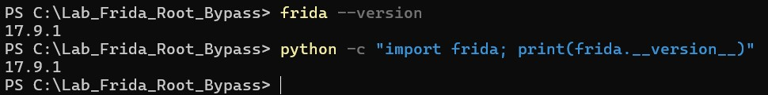
</p>

<p align="center">
  <em>Figure 1 — Vérification de la version Frida côté PC.</em>
</p>


---

## 5. Vérification de la connexion ADB

Au début du lab, la commande `adb` n’était pas reconnue directement dans PowerShell. L’erreur suivante était affichée :

```text
adb : Le terme « adb » n'est pas reconnu comme nom d'applet de commande,
fonction, fichier de script ou programme exécutable.
```

Pour résoudre ce problème, le chemin complet de `adb.exe` a été utilisé.

Commande utilisée :

```powershell
& "$env:LOCALAPPDATA\Android\Sdk\platform-tools\adb.exe" devices
```

Résultat attendu :

```text
List of devices attached
emulator-5554    device
```

Cette commande permet de vérifier que l’émulateur Android est bien connecté et reconnu par ADB.


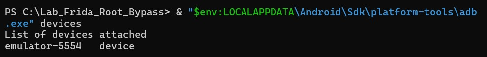

---

## 6. Activation du mode root sur l’émulateur

Pour utiliser `frida-server`, l’émulateur doit permettre l’exécution avec des privilèges root.

Commande utilisée :

```powershell
& "$env:LOCALAPPDATA\Android\Sdk\platform-tools\adb.exe" root
```

Résultat obtenu :

```text
adbd is already running as root
```

Ensuite, l’identité de l’utilisateur Android a été vérifiée avec la commande suivante :

```powershell
& "$env:LOCALAPPDATA\Android\Sdk\platform-tools\adb.exe" shell id
```

Résultat attendu :

```text
uid=0(root)
```

Cette étape confirme que l’émulateur utilisé est compatible avec l’exécution de `frida-server`.

---

## 7. Identification de l’architecture Android

Avant d’utiliser `frida-server`, il faut identifier l’architecture CPU de l’émulateur Android.

Commande utilisée :

```powershell
& "$env:LOCALAPPDATA\Android\Sdk\platform-tools\adb.exe" shell getprop ro.product.cpu.abi
```

Résultat obtenu :

```text
x86_64
```

L’architecture de l’émulateur est donc `x86_64`. Le fichier `frida-server` utilisé doit correspondre à cette architecture.


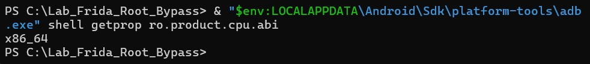

---

## 8. Déploiement de frida-server

Le fichier `frida-server` a été copié dans le répertoire temporaire de l’émulateur Android.

Commande utilisée :

```powershell
& "$env:LOCALAPPDATA\Android\Sdk\platform-tools\adb.exe" push frida-server /data/local/tmp/
```

Résultat obtenu :

```text
frida-server: 1 file pushed
```

Ensuite, les permissions d’exécution ont été ajoutées :

```powershell
& "$env:LOCALAPPDATA\Android\Sdk\platform-tools\adb.exe" shell chmod 755 /data/local/tmp/frida-server
```

Cette étape permet de rendre `frida-server` exécutable sur l’émulateur Android.


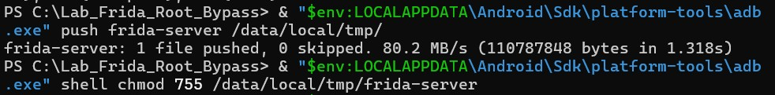

---

## 9. Lancement de frida-server

Le serveur Frida a été lancé sur l’émulateur avec la commande suivante :

```powershell
& "$env:LOCALAPPDATA\Android\Sdk\platform-tools\adb.exe" shell "/data/local/tmp/frida-server"
```

La fenêtre PowerShell utilisée pour lancer `frida-server` doit rester ouverte pendant le reste du lab.

Dans une deuxième fenêtre PowerShell, la communication avec Frida a été vérifiée :

```powershell
frida-ps -Uai
```

Cette commande permet de lister les applications Android visibles par Frida.


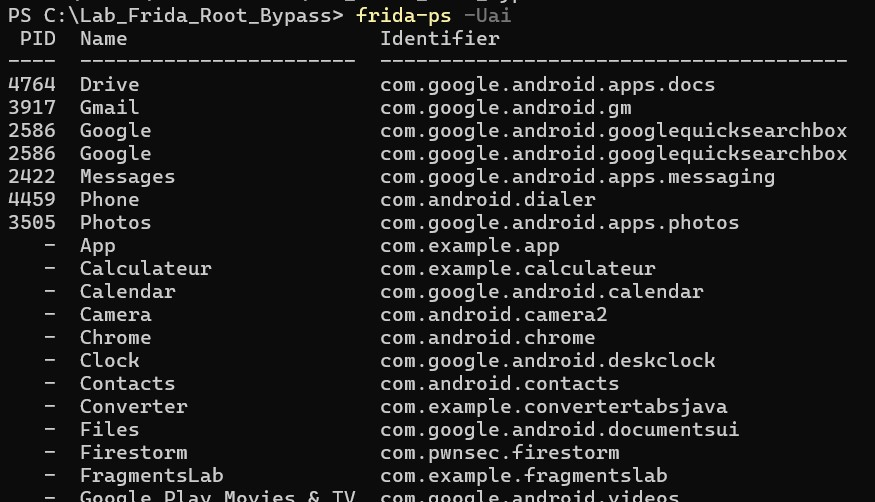

---

## 10. Installation de l’application RootBeer Sample

L’application RootBeer Sample a été installée sur l’émulateur Android.

Commande utilisée :

```powershell
& "$env:LOCALAPPDATA\Android\Sdk\platform-tools\adb.exe" install -r "C:\Users\IKRAM\Downloads\RootBeerSample.apk"
```

Résultat attendu :

```text
Success
```

Après installation, le package de l’application a été recherché avec la commande suivante :

```powershell
& "$env:LOCALAPPDATA\Android\Sdk\platform-tools\adb.exe" shell pm list packages | findstr /i "rootbeer"
```

Résultat obtenu :

```text
package:com.scottyab.rootbeer.sample
```

Le package cible utilisé dans les commandes Frida est donc :

```text
com.scottyab.rootbeer.sample
```

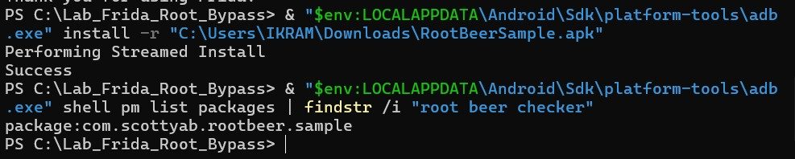

---

## 11. Test initial sans Frida

Avant d’injecter Frida, l’application RootBeer Sample a été lancée normalement afin d’observer son comportement initial.

Commande utilisée :

```powershell
& "$env:LOCALAPPDATA\Android\Sdk\platform-tools\adb.exe" shell monkey -p com.scottyab.rootbeer.sample 1
```

L’application affiche les résultats de plusieurs contrôles de root.

Résultat observé :

```text
ROOTED*
```

Cela signifie que l’application détecte que l’environnement Android est rooté.

<p align="center">
  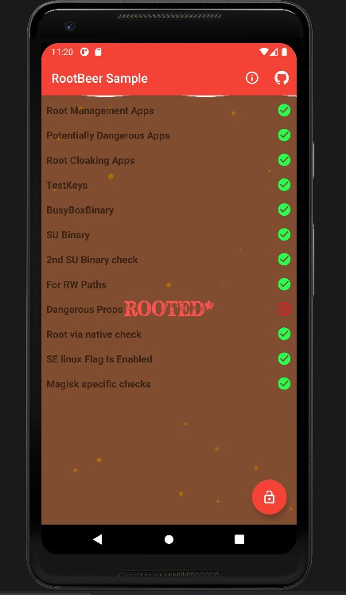
</p>

---

## 12. Création du script de bypass Java

Un script Frida nommé `bypass_root.js` a été créé dans le dossier suivant :

```text
C:\Lab_Frida_Root_Bypass\scripts\bypass_root.js
```

Ce script permet d’intercepter plusieurs vérifications Java utilisées par RootBeer Sample.

Les principales vérifications ciblées sont :

- `android.os.Build.TAGS`
- les méthodes de la classe `com.scottyab.rootbeer.RootBeer`
- `java.io.File.exists()`
- `java.lang.Runtime.exec()`

L’objectif est de bloquer la détection de fichiers et commandes liés au root.

Exemples de chemins suspects ciblés :

```text
/system/bin/su
/system/xbin/su
/sbin/su
/system/bin/busybox
/system/xbin/busybox
/data/local/magisk
```

Le script permet donc de forcer certains contrôles à retourner un résultat négatif.

---

## 13. Lancement de RootBeer Sample avec Frida

Avant l’injection du script Frida, l’application a été fermée :

```powershell
& "$env:LOCALAPPDATA\Android\Sdk\platform-tools\adb.exe" shell am force-stop com.scottyab.rootbeer.sample
```

Ensuite, RootBeer Sample a été lancée sous Frida avec le script `bypass_root.js` :

```powershell
frida -U -f com.scottyab.rootbeer.sample -l C:\Lab_Frida_Root_Bypass\scripts\bypass_root.js
```

Résultat obtenu dans PowerShell :

```text
Spawned `com.scottyab.rootbeer.sample`. Resuming main thread!
[+] Build.TAGS -> release-keys
[+] RootBeer hooks installed
[+] File.exists hook installed
[+] Runtime.exec hooks installed
[+] Java root bypass installed
```

Après avoir cliqué sur le bouton de test dans l’application, Frida intercepte plusieurs vérifications :

```text
[+] File.exists bypass: /data/local/busybox
[+] File.exists bypass: /data/local/bin/busybox
[+] File.exists bypass: /data/local/xbin/busybox
[+] File.exists bypass: /sbin/busybox
[+] File.exists bypass: /su/bin/busybox
[+] File.exists bypass: /system/bin/busybox
[+] File.exists bypass: /system/bin/.ext/busybox
[+] File.exists bypass: /system/bin/failsafe/busybox
```

Ces logs montrent que le script Frida intercepte correctement les appels Java vers `File.exists()`.


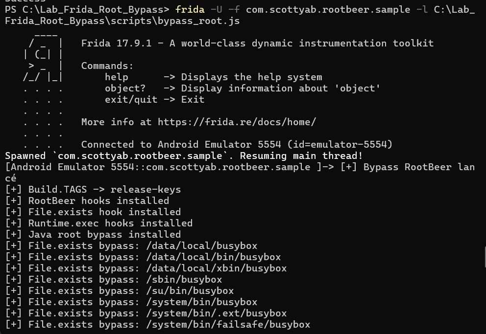

---

## 14. Résultat après bypass Java

Après l’injection du script Java, l’application a été testée de nouveau.

Résultat observé :

- plusieurs contrôles sont affichés en vert ;
- certains accès vers `su` et `busybox` sont interceptés par Frida ;
- le contrôle `Dangerous Props` passe en vert ;
- l’application affiche encore `ROOTED*`.

Le contrôle restant positif est :

```text
2nd SU Binary check
```

Ce résultat montre que le bypass Java fonctionne partiellement. Frida intercepte plusieurs vérifications, mais un contrôle spécifique continue de détecter le root.

<p align="center">
  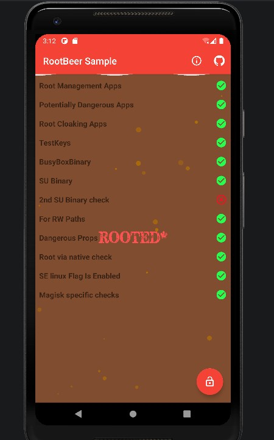
</p>


---

## 15. Traçage des appels natifs avec frida-trace

Comme l’application continue d’afficher `ROOTED*`, un traçage natif a été réalisé pour identifier les appels système utilisés par RootBeer Sample.

Au début, une erreur a été rencontrée car le package d’exemple `com.example.rootcheck` a été utilisé :

```text
Failed to spawn: unable to find application with identifier 'com.example.rootcheck'
```

La commande a ensuite été corrigée avec le vrai package :

```powershell
frida-trace -U -f com.scottyab.rootbeer.sample -i open -i openat -i access -i stat -i lstat -i fopen -i readlink
```

Résultat observé dans la console :

```text
stat()
access()
open()
readlink()
```

Ces fonctions natives peuvent être utilisées pour vérifier l’existence de fichiers liés au root au niveau système.


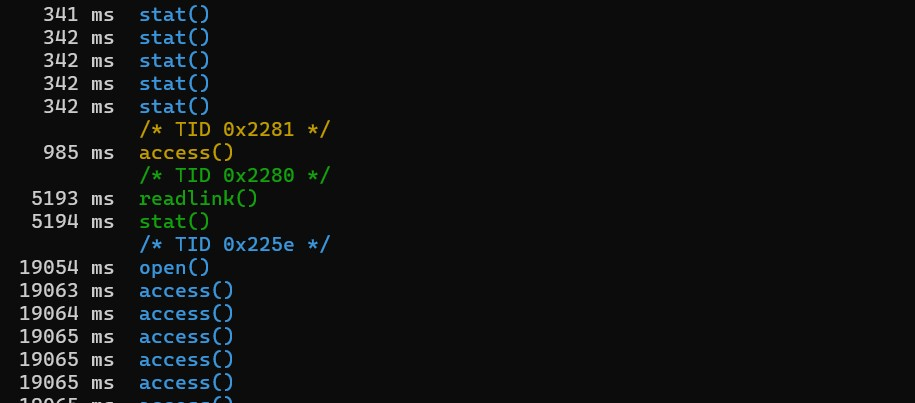

---

## 16. Création du script de bypass natif

Un deuxième script Frida nommé `bypass_native.js` a été créé dans le dossier suivant :

```text
C:\Lab_Frida_Root_Bypass\scripts\bypass_native.js
```

Ce script vise à intercepter certaines fonctions natives utilisées pour détecter le root.

Fonctions natives ciblées :

```text
open
openat
access
stat
lstat
fopen
readlink
```

Chemins suspects ciblés :

```text
/system/bin/su
/system/xbin/su
/sbin/su
/system/su
/system/bin/busybox
/system/xbin/busybox
/proc/mounts
/proc/self/mounts
```

L’objectif est de bloquer les appels natifs vers ces chemins suspects.

---

## 17. Lancement avec bypass Java et bypass natif

L’application a ensuite été lancée avec les deux scripts :

```powershell
frida -U -f com.scottyab.rootbeer.sample -l C:\Lab_Frida_Root_Bypass\scripts\bypass_root.js -l C:\Lab_Frida_Root_Bypass\scripts\bypass_native.js
```

Résultat attendu dans PowerShell :

```text
[+] Hook natif installé : open
[+] Hook natif installé : openat
[+] Hook natif installé : access
[+] Hook natif installé : stat
[+] Hook natif installé : lstat
[+] Hook natif installé : fopen
```

Ces logs montrent que les fonctions natives ont été interceptées par Frida.


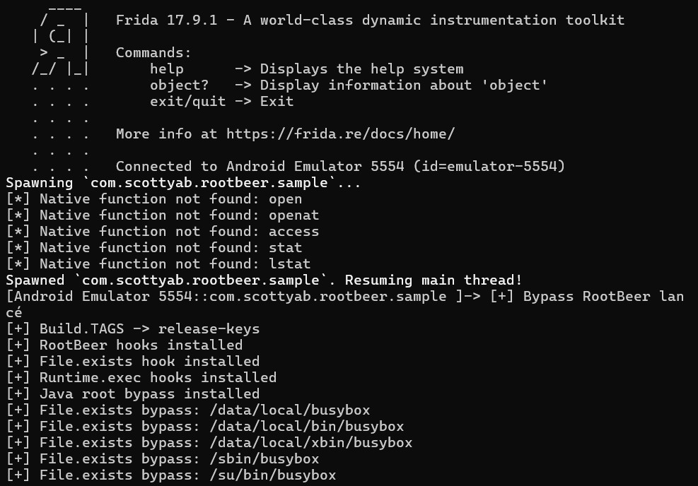

---

## 18. Résultat après bypass Java et natif

Après l’ajout du bypass natif, RootBeer Sample a été testée une nouvelle fois.

Résultat observé :

- la majorité des contrôles sont verts ;
- les hooks Java fonctionnent ;
- les appels natifs sont tracés ;
- l’application affiche encore `ROOTED*`.

Le contrôle restant positif est :

```text
2nd SU Binary check
```

Cela montre que le bypass est partiel. Les hooks Java et natifs permettent d’intercepter plusieurs mécanismes de détection, mais un contrôle spécifique reste actif.

<p align="center">
  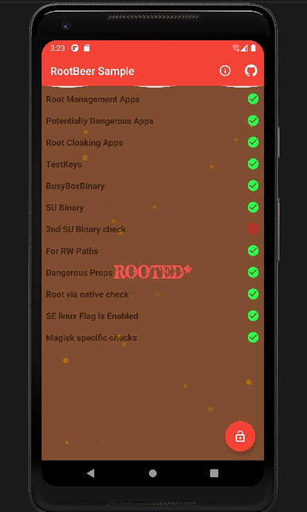
</p>

---

## 19. Analyse des résultats

Les résultats obtenus montrent que RootBeer Sample utilise plusieurs techniques pour détecter le root.

### 19.1 Vérifications Java

L’application recherche des fichiers connus liés au root :

```text
/system/bin/su
/system/xbin/su
/system/bin/busybox
/system/xbin/busybox
```

Ces vérifications sont réalisées notamment avec `File.exists()`.

Grâce au hook Frida, plusieurs appels vers ces chemins ont été interceptés.

### 19.2 Exécution de commandes

RootBeer peut également exécuter des commandes système comme :

```text
which su
```

Ces commandes peuvent être interceptées avec un hook sur `Runtime.exec()`.

Dans les logs Frida, on observe par exemple :

```text
[+] Blocked Runtime.exec: which su
```

### 19.3 Vérifications natives

Le traçage avec `frida-trace` a montré l’utilisation de fonctions natives telles que :

```text
stat()
access()
open()
readlink()
```

Ces fonctions peuvent être utilisées pour vérifier l’existence de fichiers root au niveau natif.

### 19.4 Bypass partiel

Même après l’injection Frida, l’application affiche encore `ROOTED*`.

Cela s’explique par le fait que certains contrôles ne sont pas totalement neutralisés. Dans ce lab, le contrôle restant est :

```text
2nd SU Binary check
```

Ce résultat montre qu’un bypass complet nécessite une analyse plus précise de la logique interne de l’application et des méthodes utilisées par RootBeer Sample.

---

## 20. Difficultés rencontrées

### 20.1 Commande adb non reconnue

Au début du lab, la commande suivante ne fonctionnait pas :

```powershell
adb devices
```

Erreur obtenue :

```text
adb : Le terme « adb » n'est pas reconnu
```

Solution utilisée :

```powershell
& "$env:LOCALAPPDATA\Android\Sdk\platform-tools\adb.exe" devices
```

Toutes les commandes ADB ont ensuite été exécutées avec le chemin complet de `adb.exe`.

---

### 20.2 Erreur avec frida-server

Lors du premier lancement de `frida-server`, une erreur SELinux est apparue :

```text
Unable to load SELinux policy from the kernel: Permission denied
```

La solution a été d’utiliser un émulateur rootable et d’exécuter :

```powershell
& "$env:LOCALAPPDATA\Android\Sdk\platform-tools\adb.exe" root
```

Ensuite, `frida-server` a pu être lancé correctement.

---

### 20.3 Package incorrect

Au début, le package d’exemple suivant était utilisé :

```text
com.example.rootcheck
```

Erreur obtenue :

```text
unable to find application with identifier 'com.example.rootcheck'
```

La solution a été d’utiliser le vrai package de RootBeer Sample :

```text
com.scottyab.rootbeer.sample
```

---

### 20.4 Option --no-pause non reconnue

La commande suivante a généré une erreur :

```powershell
frida -U -f com.scottyab.rootbeer.sample -l bypass_root.js --no-pause
```

Erreur obtenue :

```text
frida: error: unrecognized arguments: --no-pause
```

La solution a été de lancer Frida sans l’option `--no-pause` :

```powershell
frida -U -f com.scottyab.rootbeer.sample -l C:\Lab_Frida_Root_Bypass\scripts\bypass_root.js
```

---

### 20.5 Erreur dans Runtime.exec

Une erreur est apparue avec une première version du script :

```text
Error: String;(): argument types do not match
```

Cette erreur était liée au hook de `Runtime.exec()`. Le script a ensuite été adapté pour éviter cette erreur.

---

## 21. Conclusion

Ce lab a permis de comprendre comment une application Android peut détecter le root à travers plusieurs mécanismes Java et natifs.

L’utilisation de Frida a permis de :

- lancer une application sous instrumentation dynamique ;
- intercepter des méthodes Java ;
- modifier le comportement de certaines vérifications ;
- bloquer des recherches de fichiers liés au root ;
- tracer des fonctions natives ;
- observer les appels utilisés par l’application pour détecter le root.

Les résultats obtenus montrent que le bypass Java fonctionne partiellement, car plusieurs chemins suspects comme `su`, `busybox` et `magisk` sont interceptés. Cependant, l’application continue d’afficher `ROOTED*` à cause du contrôle `2nd SU Binary check`.

Ce résultat est important, car il montre qu’une détection root robuste repose sur plusieurs couches de contrôle. Pour obtenir un bypass complet, il serait nécessaire d’analyser plus précisément le code de l’application et d’ajouter des hooks plus ciblés.

---

## 22. Auteure

Réalisé par : Ikram Laabouki

Module : Sécurité des Applications Mobiles

Établissement : ENSA Marrakech
